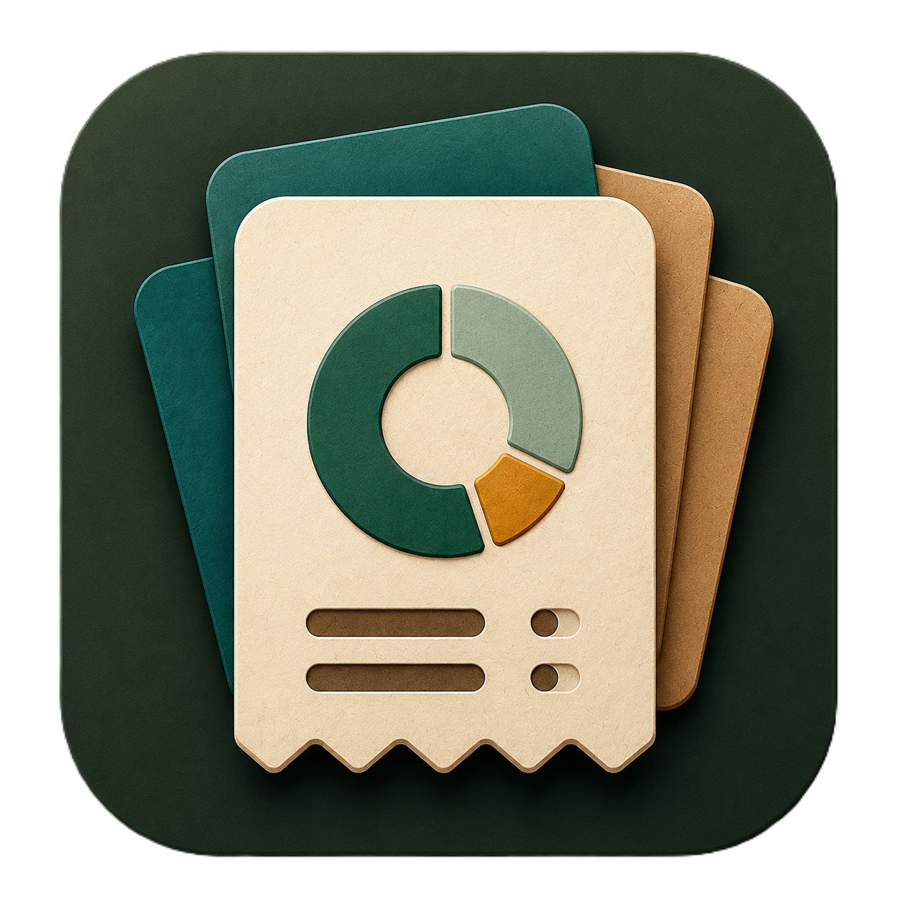

<div align="center">
  
  <h1>Nudge</h1>
  <p><strong>A calm, local-first expense manager for Android.</strong></p>
  <p>Capture bank and UPI activity, review it quickly, and understand where your money went without sending financial messages to a server.</p>

  <p>
    
    
    
    
    <a href="LICENSE"></a>
  </p>
</div>

---

## Overview

Nudge is a personal expense manager built around one idea: routine transaction logging should require almost no effort. The Android app can read bank SMS messages and payment-app notifications, parse transaction details on the device, reject duplicates, learn from review decisions, and place the result into a focused transaction timeline.

The mobile app is the primary product in this repository. The `web/` dashboard and `server/` relay are experimental companion surfaces and are not currently required by, or feature-equivalent to, the Android app.

## Highlights

| Area | What Nudge provides |
|---|---|
| Automatic capture | Bank SMS and notification-listener ingestion for debit, credit, refund, card, wallet, and UPI alerts |
| Local parsing | Bundled bank/payment templates, heuristic fallback parsing, merchant normalization, and confidence scoring |
| Smart review | Confirm, correct, categorize, or reject uncertain captures; local rules remember merchant corrections and repeated rejection patterns |
| Duplicate protection | Source IDs, message fingerprints, time/amount matching, and learned identities prevent rescanned messages from creating the same transaction again |
| Manual entry | Haptic numeric keypad, expense/income/refund types, category grid, account grid, merchant, and notes |
| Transaction timeline | Search, type filters, smart-capture filter, editable entries, source-message access, and swipe-dismiss capture feedback |
| Analytics | Monthly expense mix, category shares, and daily money-in/money-out rhythm |
| Accounts | Cash, savings, credit card, debit card, UPI, and wallet accounts in an animated stacked carousel |
| Card scanning | On-device ML Kit recognition; the captured image is discarded and only limited card metadata is retained |
| Categories | Built-in and custom categories with editable colors and a large icon catalogue |
| Local profile | Display name and profile image stored inside app-private storage |
| Data ownership | JSON export, merge-style import, source-message retention controls, and complete local-data deletion |
| Widgets | Compact, snapshot, and expanded home-screen widgets with responsive layouts |
| Polish | Dark/light themes, JetBrains Mono typography, Lucide-style icons, semantic haptics, and Compose micro-interactions |
| Reminders | Optional daily expense check-ins with rotating copy and Android notification-permission handling |

## Product flow

```text
Bank SMS / payment notification
              |
              v
     Local parser + rule pack
              |
              v
  Normalize merchant and transaction type
              |
              v
  Duplicate and learned-rule evaluation
              |
        +-----+-----+
        |           |
        v           v
 High confidence   Needs review
        |           |
        +-----+-----+
              v
      Local Room database
              |
       +------+------+
       |             |
       v             v
 Transactions     Analytics / widgets
```

Manual transactions enter the same local database and therefore appear everywhere automatic captures do.

## Privacy and security

Nudge is designed to operate without a user account or a mobile network connection.

- SMS and notification text is parsed on the Android device.
- The Android app has no internet permission in its current mobile configuration.
- Transaction data is stored in a local Room database.
- Android system backup is disabled for the application.
- A source message body is retained only when **Save transaction messages** is enabled.
- Retained source bodies are encrypted with AES-GCM using an app-owned Android Keystore key.
- Rejection learning stores stable patterns rather than raw message bodies.
- Card images are processed on-device and discarded after recognition.
- JSON exports are intentionally portable and are **not encrypted**. Store exported files securely.

### Android permissions

| Permission or access | Why it is used | Required? |
|---|---|---|
| Read and receive SMS | Scan historical financial messages and capture future bank/UPI SMS alerts | Optional; required for SMS capture |
| Notification access | Read transaction notifications from payment and banking apps | Optional; required for notification capture |
| Camera | Scan limited card metadata while creating a card account | Optional |
| Notifications | Show user-enabled expense reminders | Optional |
| Vibration | Haptic feedback for keypad and important actions | Optional experience enhancement |

All permission controls remain available from the app's Settings screen.

## Android architecture

The Android app follows a compact local-first structure:

```text
android/src/main/
├── AndroidManifest.xml
├── kotlin/com/nudge/android/
│   ├── NudgeApp.kt              Application setup and encrypted preferences
│   ├── data/
│   │   ├── Entities / DAOs      Room persistence
│   │   ├── CaptureLearning      Local correction and rejection identities
│   │   ├── SourceMessageCrypto  Android Keystore-backed message encryption
│   │   └── DefaultsSeeder       Initial accounts and categories
│   ├── service/
│   │   ├── SmsReceiver          Live SMS ingestion
│   │   ├── NotificationListener Payment-app notification ingestion
│   │   ├── ParsingWorkers       Background parsing entry points
│   │   ├── TransactionCaptureProcessor
│   │   └── ExpenseReminderWorker
│   ├── ui/
│   │   ├── MainActivity         Navigation and application shell
│   │   ├── MainViewModel        State and application actions
│   │   ├── HistoryScreen        Transactions
│   │   ├── ChartsScreen         Analytics
│   │   ├── NeedsReviewScreen    Capture review flow
│   │   ├── AddTransactionSheet  Manual entry
│   │   └── ...                  Accounts, categories, backup, settings
│   ├── ui/components/           Reusable active Compose components
│   ├── ui/theme/                Tokens, type, icons, colors, and haptics
│   └── widget/                  Three Glance widget receivers/layouts
└── res/                         Fonts, illustrations, icons, themes, widget XML
```

The live navigation graph intentionally stays small:

```text
Transactions <-> Analytics
      |
      +-> Add transaction
      +-> Needs review
      +-> Settings
             +-> Accounts
             +-> Categories
             +-> Data & backup
             +-> Saved messages
```

## Shared parsing module

`shared/` is a Kotlin Multiplatform library used by Android for models and deterministic business logic.

```text
shared/src/commonMain/kotlin/com/nudge/
├── engine/   SMS parser, bundled rules, categorization, merchant normalization,
│             duplicate detection, budget math, and recurring detection
├── model/    Transactions, accounts, categories, parser rules, and recurrence models
└── util/     Design tokens, IDs, and neutral messaging helpers
```

Keeping parsing and classification logic outside the Compose layer makes it testable without an Android device.

## Requirements

### Android

- Android Studio with Android SDK 36 installed
- JDK 17
- Android device or emulator running Android 8.0 / API 26 or newer
- Windows PowerShell or Command Prompt for the included `gradlew.bat`

### Optional web/server work

- Node.js 18 or newer
- npm

## Build and run

Clone the repository:

```powershell
git clone https://github.com/YumiNoona/Nudge.git
cd Nudge
```

Create `local.properties` if Android Studio has not created it automatically:

```properties
sdk.dir=C:\\Users\\YOUR_NAME\\AppData\\Local\\Android\\Sdk
```

Build the Android debug APK:

```powershell
.\gradlew.bat :android:assembleDebug
```

The APK is written to:

```text
android/build/outputs/apk/debug/android-debug.apk
```

For interactive development, open the repository root in Android Studio, select the `android` run configuration, and run it on an API 26+ device.

## Verification commands

Run the Android and shared unit tests:

```powershell
.\gradlew.bat :android:testDebugUnitTest :shared:testDebugUnitTest
```

Run Android lint:

```powershell
.\gradlew.bat :android:lintDebug
```

Run the complete local verification used before producing an APK:

```powershell
.\gradlew.bat :android:testDebugUnitTest :shared:testDebugUnitTest :android:lintDebug :android:assembleDebug
```

The lint report is generated at `android/build/reports/lint-results-debug.html`.

## Optional companion projects

### Web prototype

The React/Vite project is an experimental interface and should not be treated as mobile feature parity.

```powershell
cd web
npm install
npm run typecheck
npm run build
npm run dev
```

### Sync relay prototype

The Express/sql.js relay is experimental and is not connected to the current Android build.

```powershell
cd server
npm install
npm run build
npm run dev
```

## Data import and export

- **Export as JSON** writes transactions, categories, accounts, budgets, and compatible settings to a user-selected document.
- **Import from backup** merges compatible records instead of silently replacing the current archive.
- **Saved source messages** are managed separately because their bodies are Keystore-encrypted and device-bound.
- **Delete everything** is destructive and cannot be undone without a previously exported backup.

## Development guidelines

- Keep financial parsing deterministic and covered by tests.
- Do not add network transmission of SMS, notification, or card content.
- Use semantic theme colors through `DSBridge`/`Nc` rather than hard-coded light/dark assumptions.
- Use the shared Lucide wrapper for consistent icons.
- Use `NudgeHaptics` for semantic feedback rather than raw vibration calls in UI code.
- Keep navigation destinations explicit; disconnected experimental screens should live outside the production graph.
- Never commit `local.properties`, signing keys, exported databases, APKs, or environment files.

## Troubleshooting

### Automatic capture is not receiving messages

1. Open **Settings** in Nudge.
2. Enable **Log transactions automatically**.
3. Grant **SMS access** for bank/UPI text messages.
4. Enable **Notification access** for payment-app notifications.
5. Use **Scan message history** to import older compatible messages.

### A captured transaction needs correction

Open **Needs review**, correct the merchant/category/account, and confirm it. Nudge stores a local correction rule and applies it to similar future alerts.

### Android Studio reports an SDK error

Verify that `local.properties` points to a valid Android SDK and that SDK Platform 36 is installed. The app targets API 34 while compiling against API 36.

## Contributing

Issues and focused pull requests are welcome. For capture-parser changes, include anonymized sample formats and add or update tests. Never commit real financial messages, account identifiers, phone numbers, or exported user data.

## License

Nudge is available under the [MIT License](LICENSE).
